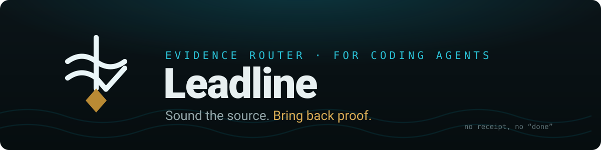
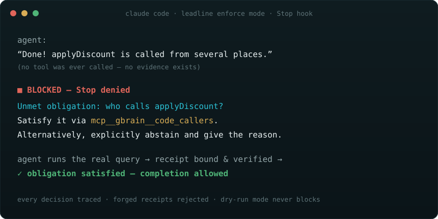

<p align="center">
  
</p>

<p align="center">
  
  
  
  
</p>

<p align="center">
  <a href="#get-started-60-seconds">Get started</a> ·
  <a href="#what-it-does">What it does</a> ·
  <a href="#policy-packs--enforcement-with-receipts">Policy packs</a> ·
  <a href="#honesty-section">Honesty</a> ·
  <a href="docs/EXAM.md">The exam story</a> ·
  <a href="AGENTS.md">For agents</a>
</p>

<p align="center">
  Say it <b>“LED-line”</b> — a sounding line, not a leadership line.
</p>

---

AI coding agents pick tools by willpower. They grep when the code graph already knows, trust stale memory when a live probe would answer, fake or skip tool calls to satisfy gates — a published LLM failure mode (*tool-call hacking*) — and declare success without evidence.

**Leadline** is a local-first evidence router and policy engine for coding agents (Claude Code today; Codex, Cursor, Windsurf and other MCP clients via advisory adapters on the roadmap). It classifies what kind of evidence a request needs — **historical, structural, repository, or runtime** — emits an ordered evidence contract pointing at the authoritative source, denies wrong-source tool calls *with the corrective route inside the denial*, grades every result as a **use receipt** (invocation alone never counts), and blocks “I’m done” while an obligation is unmet.

No LLM in the hook loop. No network. No telemetry. Deterministic local code, all the way down.

## The moment it exists for

<p align="center">
  
</p>

A real transcript from Leadline’s own acceptance run (Claude Code hooks, enforce mode). The agent tried to finish with *“Done! applyDiscount is called from several places”* — no tool had ever run. The Stop hook answered:

```
Unmet obligation: who calls applyDiscount?
Satisfy it via mcp__gbrain__code_callers.
Alternatively, explicitly abstain and give the reason.
```

Blocked. Still blocked on the second try. The third attempt is allowed with a visible warning — enforcement must never brick a session (the anti-lockup rule).

And when a receipt was forged — a `PostToolUse` result for a call that was never accepted:

```
Receipt failed (unbound): PostToolUse must match an accepted PreToolUse call in this turn.
```

## What it does

* **Route before action** — decompose the prompt into evidence obligations and inject a compact contract. `complete: false` and unmatched clauses are reported honestly, never faked.
* **Enforce per tool call** — wrong-source calls are denied with a three-part message: the unmet obligation, the exact corrective command, and the legal alternative (sanctioned fallback or explicit abstention).
* **Grade the receipt** — results are checked for substance, relevance, and freshness. Empty results, input echoes, `"No results found"` prose, and transport metadata (`status: 200`, `is_error: false`) satisfy nothing. A structured zero (`{count: 0, callers: []}`) is honest evidence and counts.
* **Gate completion** — the Stop hook refuses “done” while obligations are unmet, twice; then warns and yields.
* **Receipts can’t be forged** — `PostToolUse` results bind to the accepted `PreToolUse` call by `tool_use_id` + canonical argument digest, consumed exactly once.
* **Enforcement decisions are traced** — one JSONL line per decision; `leadline trace` renders the session story with counts: denials, corrections followed, abstentions, gaming attempts caught.

Failure semantics are mode-aware: **enforcement fails closed** (a crashed hook can’t silently disable enforcement), **advisory fails open** (a dry run can never block you).

## The loop

```
 prompt ─▶ UserPromptSubmit ─▶ evidence contract (ordered obligations)
                                    │
 tool call ─▶ PreToolUse ────▶ ALLOW │ DENY + corrective route │ ASK (human)
                                    │
 result ─▶ PostToolUse ──────▶ use receipt: empty → irrelevant → stale → satisfied
                                    │
 "done" ─▶ Stop ─────────────▶ obligations met? · else DENY ×2 → warn-and-allow
```

Four evidence families, mapped by configured routes (`policy/routes.yaml`) and enforced through policy packs:

| family | answers | typical route |
| --- | --- | --- |
| `historical` | what was decided / built / shipped | recall store, knowledge base |
| `structural` | what calls / imports / depends | code graph |
| `repository` | exact current bytes / config | grep · read · git |
| `runtime` | what is alive / deployed / responding | live probe (CLI / API) |

## Get started (60 seconds)

```bash
npx github:Nazim22/leadline init --claude-code --dry-run   # advisory: observes, never blocks
# work normally for a while, then:
npx github:Nazim22/leadline trace --project . --session <id>  # what WOULD have been caught
npx github:Nazim22/leadline init --claude-code             # flip to enforce
```

(An npm package — plain `npx leadline` — is on the roadmap; the GitHub specifier above works today. For a local checkout that is always current, clone and link:)

```bash
git clone https://github.com/Nazim22/leadline.git
cd leadline
npm install
npm link            # makes `leadline` available on your PATH from this checkout
leadline init --claude-code --dry-run
```

> **Node:** requires Node ≥ 18 (CI proves 18 / 20 / 22). The exam/replay harness is Linux-only today (see `docs/REPLAY.md`); the router, hooks, and `npm run bench` are platform-independent.

Dry-run mode is the benchmark: it watches your own sessions and shows you your agent’s wrong-source calls, empty receipts, and unproven “done” claims — your data, your numbers — before a single call is ever denied.

## Policy packs — enforcement with receipts

Every shipped rule carries a `why` field with the real measurement behind it. Packs without receipts are opinions.

| pack | rule | the burn behind it |
| --- | --- | --- |
| `code-intelligence-before-raw-search` | callers/callees/references questions must hit the code graph before raw grep | an audit found ~200 raw search calls per session re-deriving indexed facts |
| `authoritative-source-before-memory` | “what did we decide/build” must query the maintained source, not reconstruct from vibes | agents repeatedly re-derived documented decisions from code and chat |
| `prerequisite-before-protected-ops` | protected operations require reading the access map first — literal path match, no impostors | protected commands were attempted before the map was read |

Packs are plain YAML with a JSON-Schema contract (`schema/policy-pack.schema.json`). Write your own; PRs welcome — **bring your burn history** (see [CONTRIBUTING.md](CONTRIBUTING.md)).

## Honesty section

* **Enforcement is host-dependent.** Claude Code supports the full loop (deny + completion-block) and is the flagship adapter. Other hosts get advisory/audit modes via a capability-negotiated interface — the engine computes the strongest safe mode per host and never overclaims.
* **Routing quality is measured, not promised.** The deterministic router lands **62.5% first-route accuracy** (N=16 routed) and 61.1% full-plan exact-match on a small frozen eval (N=18, synthetic) — reproduce with `npm run bench`. The satisfaction simulator holds **0/4 gate-gaming bypasses**, 1/1 freshness rejections, and 0/2 false blocks. Small honest numbers we’re working against in the open beat big vague ones.
* **This project killed its own component.** We built an adversarial, pre-registered exam (three frontier models, blind 2-of-3 adjudication, sealed artifacts) to certify a claim detector before wiring it in. The detector failed decisively — recall ceiling ~7% against a 40% gate — so it shipped as nothing. The exam machinery became our acceptance framework instead. Full story: [docs/EXAM.md](docs/EXAM.md).
* **When to skip:** if your agent has no better sources than grep — no code graph, no knowledge base, no live systems — there is little to route to. Start with the dry run and see if it finds anything worth enforcing.

## Docs

* [docs/DESIGN.md](docs/DESIGN.md) — architecture and design decisions
* [docs/EXAM.md](docs/EXAM.md) — the exam that killed our detector (methodology, sealed-artifact protocol, pre-publication security backlog)
* [docs/REPLAY.md](docs/REPLAY.md) — the frozen replay / coverage harness
* [AGENTS.md](AGENTS.md) — entry point for AI agents · [llms.txt](llms.txt) — documentation map for LLMs
* [CONTRIBUTING.md](CONTRIBUTING.md) — how to contribute (the burn-receipt rule lives here) · [SECURITY.md](SECURITY.md) — reporting and honest threat model

## License

MIT. Claims should carry receipts — that’s rather the point.
